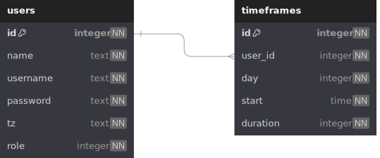

# M4 Specs

## Database Schema



start is stored in UTC

## Api Specifications

### Users

<details>

<summary><code>POST /users</code></summary>

#### Description

Create a new user

#### Security

role: Admin

#### Body

> | name     | type   | required |
> | -------- | ------ | -------- |
> | name     | string | ✓        |
> | username | string | ✓        |
> | password | string | ✓        |
> | tz       | text   | ✓        |

#### Responses

> | code | description |
> | ---- | ----------- |
> | 201  |             |
> | 400  |             |
> | 403  |             |

</details>

<details>

<summary><code>PUT /users/{id}</code></summary>

#### Description

Update a user

#### Security

role: Admin\
user: Own user

#### Body

> | name     | type   | required |
> | -------- | ------ | -------- |
> | name     | string |          |
> | username | string |          |
> | password | string |          |
> | tz       | text   |          |

#### Responses

> | code | description |
> | ---- | ----------- |
> | 200  |             |
> | 400  |             |
> | 403  |             |

</details>

<details>

<summary><code>DELETE /users/{id}</code></summary>

#### Description

Delete a user

#### Security

role: Admin

#### Body

> | name | type | required |
> | ---- | ---- | -------- |

#### Responses

> | code | description |
> | ---- | ----------- |
> | 200  |             |
> | 403  |             |

</details>

<details>

<summary><code>GET /users</code></summary>

#### Description

Get users

#### Body

> | name | type | required |
> | ---- | ---- | -------- |

#### Responses

> | code | description |
> | ---- | ----------- |
> | 200  | [User]      |

</details>

<details>

<summary><code>POST /users/{id}/timeframes</code></summary>

#### Description

Create a new timeframe

#### Security

role: Admin\
user: Own user

#### Body

> | name     | type    | required |
> | -------- | ------- | -------- |
> | day      | integer | ✓        |
> | start    | time    | ✓        |
> | duration | integer | ✓        |

#### Responses

> | code | description |
> | ---- | ----------- |
> | 201  |             |
> | 400  |             |
> | 403  |             |

</details>

<details>

<summary><code>GET /users/{id}/timeframes</code></summary>

#### Description

Get user timeframes

#### Body

> | name | type | required |
> | ---- | ---- | -------- |

#### Responses

> | code | description |
> | ---- | ----------- |
> | 200  | [Timeframe] |

</details>

### Auth

<details>

<summary><code>POST /auth/login</code></summary>

#### Description

Login

#### Body

> | name     | type   | required |
> | -------- | ------ | -------- |
> | username | string | ✓        |
> | password | string | ✓        |

#### Responses

> | code | description                                |
> | ---- | ------------------------------------------ |
> | 200  | Returns the session cookie in `SET-COOKIE` |
> | 400  |                                            |

</details>

<details>

<summary><code>POST /auth/logout</code></summary>

#### Description

Logout

#### Body

> | name | type | required |
> | ---- | ---- | -------- |

#### Responses

> | code | description |
> | ---- | ----------- |
> | 200  |             |
> | 400  |             |

</details>

### Timeframes

<details>

<summary><code>PUT /timeframes/{id}</code></summary>

#### Description

Update a timeframe

#### Security

role: Admin\
user: Own user

#### Body

> | name     | type    | required |
> | -------- | ------- | -------- |
> | day      | integer |          |
> | start    | time    |          |
> | duration | integer | ✓        |

#### Responses

> | code | description |
> | ---- | ----------- |
> | 200  |             |
> | 400  |             |
> | 403  |             |

</details>

<details>

<summary><code>DELETE /timeframes/{id}</code></summary>

#### Description

Delete a timeframe

#### Security

role: Admin\
user: Own user

#### Body

> | name | type | required |
> | ---- | ---- | -------- |

#### Responses

> | code | description |
> | ---- | ----------- |
> | 200  |             |
> | 403  |             |

</details>

<details>

<summary><code>GET /timeframes</code></summary>

#### Description

Get all timeframes

#### Body

> | name | type | required |
> | ---- | ---- | -------- |

#### Responses

> | code | description |
> | ---- | ----------- |
> | 200  | [Timeframe] |

</details>

## Proposed Tooling

Use [chrono-tz](https://crates.io/crates/chrono-tz) for timezone calculations.

Use [actix-web](https://crates.io/crates/actix-web) for api backend.\
Use [actix-session](https://crates.io/crates/actix-session) for session management.

Use [postgres](https://www.postgresql.org/) as the database.\
Use [sqlx](https://crates.io/crates/sqlx) for database bindings.

## Example Code

```rs
use chrono::Datelike as _;

#[derive(Debug)]
struct Timeframe {
    day: u32,
    start: chrono::NaiveTime,
    duration: i64,
}

fn main() {
    let timeframes = [
        Timeframe {
            day: 0,
            start: chrono::NaiveTime::from_hms_opt(4, 0, 0).unwrap(),
            duration: 11,
        },
        Timeframe {
            day: 0,
            start: chrono::NaiveTime::from_hms_opt(2, 0, 0).unwrap(),
            duration: 2,
        },
        Timeframe {
            day: 1,
            start: chrono::NaiveTime::from_hms_opt(10, 0, 0).unwrap(),
            duration: 11,
        },
        Timeframe {
            day: 6,
            start: chrono::NaiveTime::from_hms_opt(4, 0, 0).unwrap(),
            duration: 10,
        },
        Timeframe {
            day: 6,
            start: chrono::NaiveTime::from_hms_opt(16, 0, 0).unwrap(),
            duration: 4,
        },
    ];

    println!("Melbourne");
    {
        let to_tz = chrono_tz::Australia::Melbourne;
        let timeframes = convert(&timeframes, to_tz, 0);
        for timeframe in timeframes {
            println!("{timeframe:?}");
        }
    }

    println!("\nLos Angeles");
    {
        let to_tz = chrono_tz::America::Los_Angeles;
        let timeframes = convert(&timeframes, to_tz, 0);
        for timeframe in timeframes {
            println!("{timeframe:?}");
        }
    }
}

fn convert(timeframes: &[Timeframe], to_tz: chrono_tz::Tz, week_offset: i64) -> Vec<Timeframe> {
    // get the correct start of the week of the timezone we are converting to
    let week_start = chrono::Utc::now().with_timezone(&to_tz).date_naive()
        + chrono::Duration::weeks(week_offset);
    let week_start =
        week_start - chrono::Duration::days(week_start.weekday().num_days_from_monday() as i64);

    // bounds of the week
    let min_start = week_start
        .and_time(chrono::NaiveTime::MIN)
        .and_local_timezone(to_tz)
        .unwrap();
    let max_end = min_start + chrono::Duration::weeks(1);

    let mut converted_timeframes = Vec::new();

    for timeframe in timeframes {
        let day = week_start + chrono::Duration::days(timeframe.day as i64);

        let start = day
            .and_time(timeframe.start)
            .and_utc()
            .with_timezone(&to_tz);
        let end = start + chrono::Duration::hours(timeframe.duration);

        // check if timeframe falls into the bounds
        if start >= min_start && start < max_end || end <= max_end && end > min_start {
            let start = start.max(min_start);
            let end = end.min(max_end);

            let duration = (end - start).num_hours();

            converted_timeframes.push(Timeframe {
                day: start.weekday().num_days_from_monday(),
                start: start.time(),
                duration,
            });
        }

        // edge case: monday bleeds into sunday
        {
            let day = day + chrono::Duration::weeks(1);

            let start = day
                .and_time(timeframe.start)
                .and_utc()
                .with_timezone(&to_tz);

            if start < max_end {
                let max_duration = (max_end - start).num_hours();
                let duration = timeframe.duration.min(max_duration);

                converted_timeframes.push(Timeframe {
                    day: start.weekday().num_days_from_monday(),
                    start: start.time(),
                    duration,
                });
            }
        }

        // edge case: sunday bleeds into monday
        {
            let day = day - chrono::Duration::weeks(1);

            let start = day
                .and_time(timeframe.start)
                .and_utc()
                .with_timezone(&to_tz);
            let end = start + chrono::Duration::hours(timeframe.duration);

            if end > min_start {
                let start = start.max(min_start);

                let duration = (end - start).num_hours();

                converted_timeframes.push(Timeframe {
                    day: start.weekday().num_days_from_monday(),
                    start: start.time(),
                    duration,
                });
            }
        }
    }

    converted_timeframes
}
```
